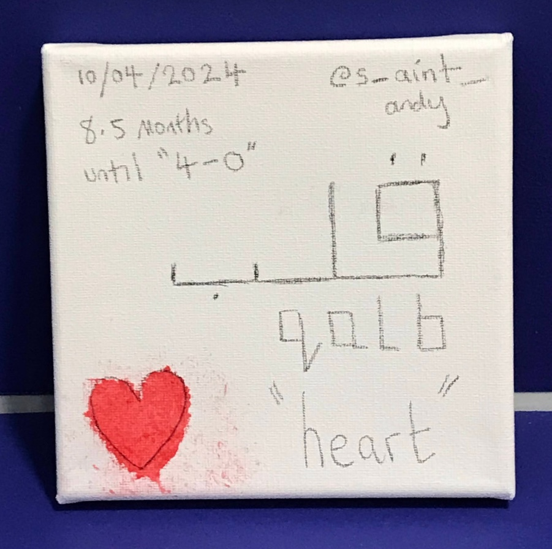

# Quantum Sand

When I was studying Physics at the University of London Royal Holloway, I had an idea. What if there was a way to help teach poor kids and adults through an app?

The result of this thought process is now an app that is nearing completion for testing.

Quantum Sand is an everything app, including an educational art-game-storytelling platform. Written in React, Rust, Ruby-on-Rails, C++ and Qml. Blender is used for the artwork.

Quantum Sand is primarily Linux based but I would love to support Windows and macOS. The only blocker is the lack of Wayland compositor support within Qt on those platforms.

A special trick is used to embed Rust videogames into a hovering 3d surface. Until Windows and macOS support Wayland, Windows and macOS will be unable to run Quantum Sand correctly.

Quantum Sand is under the AGPLv3 and CC BY-SA 4.0 licenses.

Non-intrusive privacy-focused geospatial ads are planned within Quantum Sand. The objective is to avoid annoying adverts getting in the way of the learning.

## Storytelling

Within the storytelling of Quantum Sand, the main characters who teach Xenia and Andrew, are Chinese and Japanese.

The Chinese characters are Ai and Zhao.

The Japanese characters are Sakura and Akio.

This reflects a deep fascination with Chinese and Japanese storytelling and artwork over a long period.

Storytelling in videogames such as Link's Awakening, Ocarina of Time and Shenmue have left an impression that has lasted for decades.

## Live USB stick; STEM programme for Women and Girls

Quantum Sand can be distributed via a Live USB stick. This should help women and girls who are banned from education due to extreme interpretations of various religions. This will turn into the Quantum Sand STEM programme for Women and Girls.

## Video clip of Quantum Sand

These videos only capture part of the overall functionality within Quantum Sand.

## Screenshots of Quantum Sand

Quantum Sand Educational Art Game Storytelling

Market

Services

AV

Mail

Collaborate

Chirp

Audio

Images

## Target hardware

The target hardware for Quantum Sand is the QALB-Boy which is still in planning. Qalb is the Arabic word for heart. Both physically and spiritually.

Target hardware for Quantum Sand; QALB-Boy specification. More to follow...

* LimeSDR Mini 2.0 (optional)
* An AMD Ryzen SBC or an AI accelerator SBC (possibly an NVIDIA Jetson Orin Nano Super, or a Chinese alternative).
* More to follow...

Note: The only blocker at present, is reliable Gentoo Linux support. The NVIDIA Jetson Orin Nano is a favourite but Gentoo Linux is an unknown.

## Interfaith collaboration

* 🤲 Interfaith collaboration is a planned feature for Quantum Sand.
* 👯 I’m looking to collaborate on Quantum Sand.
* 🤔 I’m looking for help with building a community around Quantum Sand.

## Special thanks

Vital for Quantum Sand;

* Google’s Chromium
* Qt’s WebEngineView and Qml
* Tyson Tan’s friendly dragon art concept
* Dedouze’s unique art style (inspired my own art style)
* Blender (used for the art)
* Twitter Emoji (Twemoji) are licensed under MIT, CC-BY-4.0 licenses.
* Hundreds of developers for all of the deps I am using.
