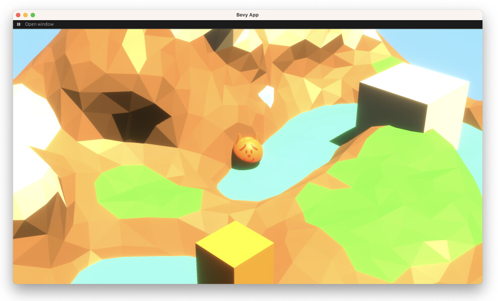

# Quantum Sand Videogame Doggo

Doggo is coded in Rust and bevy. I am planning to use PyO3 to call Python functions from Rust:
* Python Optimal Transport; Sliced Wasserstein
* PyMC; Markov Chain Monte Carlo
* SciPy; Wasserstein distance

More to follow...
